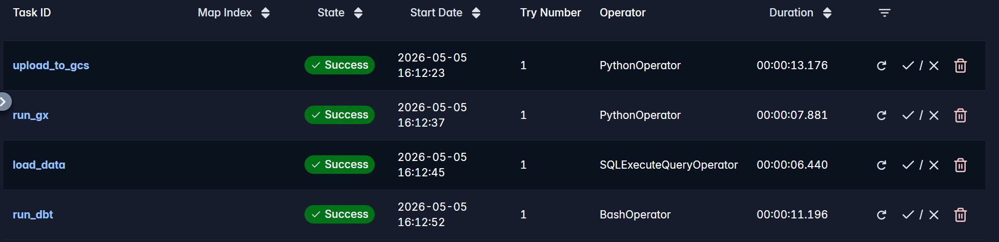
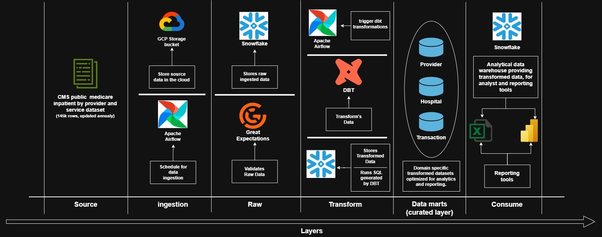

# Healthcare Data Pipeline

An end to end ELT pipeline built to ingest, validate, transform, and serve healthcare data using a modern data stack. The focus of this project is the data engineering lifecycle — not analytics — with an emphasis on data quality, containerisation, and orchestration.



The final output is a fully automated, self-contained pipeline that can run independently on any machine. Containerised with Docker and orchestrated through Airflow, the pipeline incorporates data quality checks at multiple stages paired with loud alerting on failure ,delivering a reliable, production minded ELT process built on modern data stack tooling.

---

## Architecture

Orchestrated end to end by **Apache Airflow**, containerised with **Docker**.



## Schema


---

## Pipeline Tasks

Tasks run sequentially, each dependent on the previous succeeding:

1. **upload_to_gcs** — uploads raw data to GCS bucket
2. **run_gx** — validates data in GCS against quality expectations
3. **load_data** — loads validated data into Snowflake raw schema
4. **run_dbt** — runs staging views and builds star schema (dim + fact tables)

---

## Data Quality

Validation happens at two stages:

**Pre-load (Great Expectations)**
- Column count = 15
- Column names match expected schema
- Key columns are not null
- Numerical columns meet minimum value thresholds

**Post-load (dbt)**
- `not_null` and `unique` constraints on dim and fact tables
- Foreign key relationship validation between tables
- Custom SQL tests for numerical column integrity

Any failure at either stage stops the pipeline and triggers an email alert.

---

## How to Run

> For initial setup instructions see: [Instructions](Instructions.md)

```bash
# Start containers
docker compose up -d

# Trigger DAG manually via Airflow UI
# http://localhost:8080
```

DAGs are set to manual trigger only (`schedule=None`), as this is a yearly dataset.

---

## Tech Stack

- Docker
- Python
- Apache Airflow
- Snowflake
- dbt
- Great Expectations
- Google Cloud Storage

---

## Future Improvements

- OpenLineage integration for data lineage tracking
- CI/CD for pipeline deployment
- Expanded alerting and monitoring
